# Références

- https://fr.wikipedia.org/wiki/Portable_Executable
- https://learn.microsoft.com/fr-fr/windows/win32/debug/pe-format
- https://raw.githubusercontent.com/corkami/pics/master/binary/pe101/pe101-64.png
- https://0xrick.github.io
- https://learn.microsoft.com/en-us/archive/msdn-magazine/2002/march/inside-windows-an-in-depth-look-into-the-win32-portable-executable-file-format-part-2
- https://blog.pegasy.co/portable-executable-file-format

# L'en-tête MS-DOS

Dans le cas (improbable !) où le binaire serait exécuté dans un environnement MS-DOS, cet en-tête fait du programme un programme MS-DOS valide, indiquant à l'utilisateur que ledit programme n'a pas vocation à être exécuté dans un environnement MS-DOS.

La structure en langage C de cet en-tête est disponible sur wikipedia :

```
typedef struct _IMAGE_DOS_HEADER {      // DOS .EXE header
    WORD   e_magic;                     // Magic number
    WORD   e_cblp;                      // Bytes on last page of file
    WORD   e_cp;                        // Pages in file
    WORD   e_crlc;                      // Relocations
    WORD   e_cparhdr;                   // Size of header in paragraphs
    WORD   e_minalloc;                  // Minimum extra paragraphs needed
    WORD   e_maxalloc;                  // Maximum extra paragraphs needed
    WORD   e_ss;                        // Initial (relative) SS value
    WORD   e_sp;                        // Initial SP value
    WORD   e_csum;                      // Checksum
    WORD   e_ip;                        // Initial IP value
    WORD   e_cs;                        // Initial (relative) CS value
    WORD   e_lfarlc;                    // File address of relocation table
    WORD   e_ovno;                      // Overlay number
    WORD   e_res[4];                    // Reserved words
    WORD   e_oemid;                     // OEM identifier (for e_oeminfo)
    WORD   e_oeminfo;                   // OEM information; e_oemid specific
    WORD   e_res2[10];                  // Reserved words
    LONG   e_lfanew;                    // File address of new exe header
  } IMAGE_DOS_HEADER, *PIMAGE_DOS_HEADER;
```

Les principales contraintes sur cet en-têtes sont :

- Les deux premiers octets, e_magic, qui doivent valoir `\x4d\x5a`, c'est-à-dire 'MZ',

- Les quatres derniers octets, à l'offset `0x3c`, qui indique l'offset du prochain en-tête (l'en-tête PE).

# Le segment DOS

C'est le code qui serait exécuté en environnement MS-DOS. Ce code affiche le message d'avertissement "This program cannot be run in DOS mode".

# L'en-tête PE

Aussi nommé en-tête NT, l'en-tête PE suit le segment DOS et est constituée de deux sous en-têtes : Le File Header, et l'optional Header (qui n'a d'optionnel que le nom).

```
typedef struct _IMAGE_NT_HEADERS {
  DWORD                 Signature;
  IMAGE_FILE_HEADER     FileHeader;
  IMAGE_OPTIONAL_HEADER OptionalHeader;
} IMAGE_NT_HEADERS, *PIMAGE_NT_HEADERS;
```

- La signature sur quatres octets doit valoir `\x50\x45\x00\x00`.

## Le File header

```
typedef struct _IMAGE_FILE_HEADER {
  WORD  Machine;
  WORD  NumberOfSections;
  DWORD TimeDateStamp;
  DWORD PointerToSymbolTable;
  DWORD NumberOfSymbols;
  WORD  SizeOfOptionalHeader;
  WORD  Characteristics;
} IMAGE_FILE_HEADER, *PIMAGE_FILE_HEADER;
```

- `Machine` indique le type de processeur,

- `NumberOfSections` indique le nombre de sections,

- `Characteristics` est un champ de bits contenant différentes informations sur le fichier :

   - `IMAGE_FILE_EXECUTABLE_IMAGE` : Le fichier peut être exécuté.
	
   - `IMAGE_FILE_LARGE_ADDRESS_AWARE` : Le fichier peut gérer plus de 2Go d'adresses.
	
   - `IMAGE_FILE_32BIT_MACHINE` : Le fichier est destiné à une architecture 32 bits.
	
   - `IMAGE_FILE_DEBUG_STRIPPED` : Les informations de debug ont été supprimées.
	
   - `IMAGE_FILE_DLL` : Le fichier est une dll.

## Optional header

L'optional header se situe juste après le file header :

```
typedef struct _IMAGE_OPTIONAL_HEADER64 {
  WORD                 Magic;
  BYTE                 MajorLinkerVersion;
  BYTE                 MinorLinkerVersion;
  DWORD                SizeOfCode;
  DWORD                SizeOfInitializedData;
  DWORD                SizeOfUninitializedData;
  DWORD                AddressOfEntryPoint;
  DWORD                BaseOfCode;
  ULONGLONG            ImageBase;
  DWORD                SectionAlignment;
  DWORD                FileAlignment;
  WORD                 MajorOperatingSystemVersion;
  WORD                 MinorOperatingSystemVersion;
  WORD                 MajorImageVersion;
  WORD                 MinorImageVersion;
  WORD                 MajorSubsystemVersion;
  WORD                 MinorSubsystemVersion;
  DWORD                Win32VersionValue;
  DWORD                SizeOfImage;
  DWORD                SizeOfHeaders;
  DWORD                CheckSum;
  WORD                 Subsystem;
  WORD                 DllCharacteristics;
  ULONGLONG            SizeOfStackReserve;
  ULONGLONG            SizeOfStackCommit;
  ULONGLONG            SizeOfHeapReserve;
  ULONGLONG            SizeOfHeapCommit;
  DWORD                LoaderFlags;
  DWORD                NumberOfRvaAndSizes;
  IMAGE_DATA_DIRECTORY DataDirectory[IMAGE_NUMBEROF_DIRECTORY_ENTRIES];
} IMAGE_OPTIONAL_HEADER64, *PIMAGE_OPTIONAL_HEADER64;
```

- `Magic` : Un magic number spécifiant le type du fichier. Les valeurs possibles sont :

   - `IMAGE_NT_OPTIONAL_HDR32_MAGIC (0x10b)` : Le fichier est un exécutable 32 bits.

   - `IMAGE_NT_OPTIONAL_HDR64_MAGIC (0x20b)` : Le fichier est un exécutable 64 bits.

   - `IMAGE_ROM_OPTIONAL_HDR_MAGIC (0x107)` : Le fichier est une image ROM.

- `SizeOfCode` : Taille de la section de code.

- `SizeOfInitializedData` : Taille de la section de données initialisées.

- `SizeOfUninitializedData` : Taille de la section de données non initialisées.

- `AddressOfEntryPoint` : Adresse du point d'entrée : C'est l'adresse physique du point d'entrée, c'est-à-dire son offset dans le fichier.

- `BaseOfCode` : Adresse du début de la section de code. Là aussi, on parle de l'offset dans le fichier.

- `ImageBase` : Adresse en mémoire du premier octet du fichier.

- `SectionAlignment` : Alignement des sections en mémoire.

- `FileAlignement` : Alignement des données des sections dans le fichier.

- `SizeOfImage` : Taille de l'image en octets.

- `SizeOfHeaders` : Somme des tailles des en-têtes, arrondie à un multiple de `FileAlignement`.

- `Subsystem` : Spécifie quel système peut exécuter ce fichier.

- `DllCharacteristics` : Spécifie diverses propriétés de l'exécutable.

## Optional header - Data Directories

À la fin de l'optional header se trouve un tableau de `NumberOfRvaAndSizes` "répertoires".

Chacun de ces répertoires est un couple constitué d'une RVA et d'une taille :

```
typedef struct _IMAGE_DATA_DIRECTORY {
  DWORD VirtualAddress;
  DWORD Size;
} IMAGE_DATA_DIRECTORY, *PIMAGE_DATA_DIRECTORY;
```

Ces répertoires servent à spécifier l'emplacement et la taille de différentes informations nécessaires au loader :

Table des imports, table des exports, table des ressources, et tutti quanti.

En pratique, `NumberOfRvaAndSizes` vaut `IMAGE_NUMBEROF_DIRECTORY_ENTRIES`, c'est-à-dire 16.

Les répertoires sont donc généralement les suivants :

```
#define IMAGE_DIRECTORY_ENTRY_EXPORT          0   // Export Directory
#define IMAGE_DIRECTORY_ENTRY_IMPORT          1   // Import Directory
#define IMAGE_DIRECTORY_ENTRY_RESOURCE        2   // Resource Directory
#define IMAGE_DIRECTORY_ENTRY_EXCEPTION       3   // Exception Directory
#define IMAGE_DIRECTORY_ENTRY_SECURITY        4   // Security Directory
#define IMAGE_DIRECTORY_ENTRY_BASERELOC       5   // Base Relocation Table
#define IMAGE_DIRECTORY_ENTRY_DEBUG           6   // Debug Directory
//      IMAGE_DIRECTORY_ENTRY_COPYRIGHT       7   // (X86 usage)
#define IMAGE_DIRECTORY_ENTRY_ARCHITECTURE    7   // Architecture Specific Data
#define IMAGE_DIRECTORY_ENTRY_GLOBALPTR       8   // RVA of GP
#define IMAGE_DIRECTORY_ENTRY_TLS             9   // TLS Directory
#define IMAGE_DIRECTORY_ENTRY_LOAD_CONFIG    10   // Load Configuration Directory
#define IMAGE_DIRECTORY_ENTRY_BOUND_IMPORT   11   // Bound Import Directory in headers
#define IMAGE_DIRECTORY_ENTRY_IAT            12   // Import Address Table
#define IMAGE_DIRECTORY_ENTRY_DELAY_IMPORT   13   // Delay Load Import Descriptors
#define IMAGE_DIRECTORY_ENTRY_COM_DESCRIPTOR 14   // COM Runtime descriptor
```

# Table des sections aka Section Table aka Section headers

C'est un tableau de structures de ce genre :

```
typedef struct _IMAGE_SECTION_HEADER {
  BYTE  Name[IMAGE_SIZEOF_SHORT_NAME];
  union {
    DWORD PhysicalAddress;
    DWORD VirtualSize;
  } Misc;
  DWORD VirtualAddress;
  DWORD SizeOfRawData;
  DWORD PointerToRawData;
  DWORD PointerToRelocations;
  DWORD PointerToLinenumbers;
  WORD  NumberOfRelocations;
  WORD  NumberOfLinenumbers;
  DWORD Characteristics;
} IMAGE_SECTION_HEADER, *PIMAGE_SECTION_HEADER;
```

Le nombre d'élements dans ce tableau étant déterminé par le champ `NumberOfSections` du `FileHeader`.

Le champ `Characteristics` est un champ de bits qui spécifient différentes propriétés de la section :

- Son contenu (`IMAGE_SCN_CNT_CODE` si la section contient du code exécutable, `IMAGE_SCN_CNT_INITIALIZED_DATA` si elle contient des données initialisées)

- Les droits positionnés (`IMAGE_SCN_MEM_EXECUTE`, `IMAGE_SCN_MEM_READ`, `IMAGE_SCN_MEM_WRITE` selon que les droits d'exécution, de lecture ou d'écriture sont positionnés sur la zone mémoire où est chargée la section).

# Des sections et des tables ?

Les sections contiennent des tables :

```
$ ./peparser.py ./kdnet.exe
(...)
section n°0: b'.text\x00\x00\x00' 0x1000
section n°1: b'.rdata\x00\x00' 0x11000
	directory n°1 Import Table 0x1b180
	directory n°6 Debug 0x18f98
	directory n°10 Load Config Table 0x11070
	directory n°12 IAT 0x111b0
section n°2: b'.data\x00\x00\x00' 0x1d000
section n°3: b'.pdata\x00\x00' 0x1e000
	directory n°3 Exception Table 0x1e000
section n°4: b'.rsrc\x00\x00\x00' 0x1f000
	directory n°2 Resource Table 0x1f000
section n°5: b'.reloc\x00\x00' 0x20000
	directory n°4 Certificate Table 0x21000
	directory n°5 Base Relocation Table 0x20000
```

Note : cette trace provient d'un dissecteur de PE ad-hoc, dont les résultats sont à prendre avec des pincettes.
Quoiqu'il en soit, CFF Explorer retourne un résultat similaire, en particulier pour la section `.rdata`, qui contient :

- L'Import Table,

- La Load Config Table,
 
- L'IAT.

# Liste des sections "spéciales"

Certaines sections ont un rôle et un contenu prédéfini (la liste n'est pas exhaustive !) :

- `.data` : Données initialisées.

- `.edata` : Export tables.

- `.idata` : Import tables.

- `.rdata` : Données initialisées en lecture seule.

- `.reloc` : Informations de relocalisation.

- `.rsrc` : Ressources.

- `.text` : Code exécutable.

- `.tls` : Thread-local storage.

# La gestion des imports 

En première approche, la gestion des imports repose sur 3 tables :

- L'Import Directory Table,

- L'Import Lookup Table,

- L'Import Address Table.

Dans les grandes lignes,

- Il y a une entrée dans l'Import Directory Table pour chaque dll importée,

- Chacune de ces entrées pointe vers l'Import Lookup Table et l'Import Address Table,

- Il y a une entrée dans chacune de ces deux tables pour chaque fonctions importées dans la dll en question,

- Chacune de ces entrées est :

	- ou bien un entier interprété comme l'index de la fonction dans la dll ("ici on importe la 12ème fonction de la dll trucmuche") :  C'est l'import par ordinal,

	- ou bien une adresse vers le nom de la fonction importée ("ici on importe la fonction youpiyou() de la dll trucmuche") : C'est l'import par nom,

- Le contenu de l'ILT et de l'IAT est identique dans le fichier PE,

- Cependant à l'exécution le contenu de l'IAT est modifié, et les entrées qui sont initialement l'indice (on parle d'ordinal) ou l'adresse du nom d'une fonction importée sont remplacées par l'adresse du point d'entrée en mémoire de la fonction.

Les dessin ci-dessous (issus de https://tech-zealots.com/malware-analysis/journey-towards-import-address-table-of-an-executable-file/) résument parfaitement l'organisation de ces tables au repos :

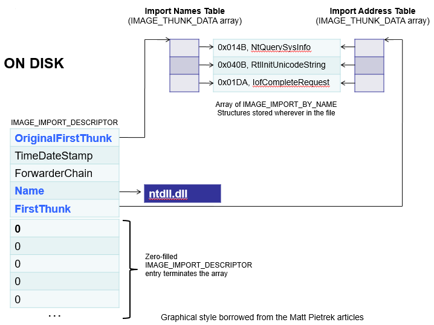

et à l'exécution :

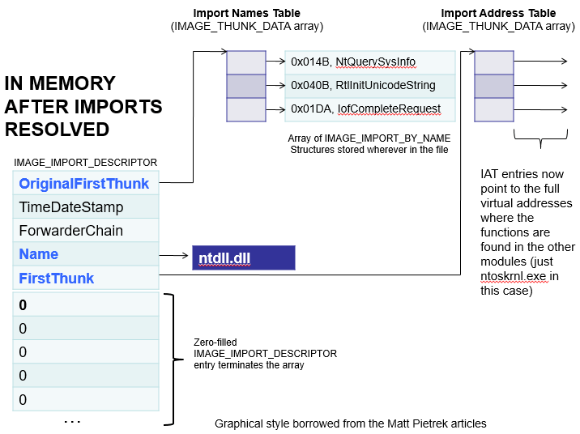

## L'import Directory Table


L'import Directory Table est une table de :

```
typedef struct _IMAGE_IMPORT_DESCRIPTOR {
    union {
        DWORD   Characteristics;
        DWORD   OriginalFirstThunk; // RVA ILT
    } DUMMYUNIONNAME;
    DWORD   TimeDateStamp;
    DWORD   ForwarderChain;
    DWORD   Name;       // RVA DllName
    DWORD   FirstThunk; // RVA IAT
} IMAGE_IMPORT_DESCRIPTOR;
typedef IMAGE_IMPORT_DESCRIPTOR UNALIGNED *PIMAGE_IMPORT_DESCRIPTOR;
```

- `OriginalFirstThunk` (aussi nommé Import Lookup Table RVA) : RVA de l'ILT,

- `TimeDateStamp` : utilisé dans la gestion des "bound imports",

- `ForwarderChain` : utilisé dans le "dll forwarding" (situation où une dll transfère certains de ces exports à une autre dll),

- `Name` : RVA du nom de la DLL,

- `FirstThunk` : RVA de l'IAT.

Les principaux champs de cette structure sont donc :

- les RVA respectives de l'ILT et de l'IAT,

- La RVA du nom de la dll importée.

## Les Bound Imports ?

Un "bound import" est un import pour lequel l'adresse mémoire de l'IAT est prédéterminée. On pourra ignorer ce mécanisme en première analyse.

## Import Lookup Table

L'ILT est une table d'entrées ayant la structure ci-dessous :

```
struct {
   unsigned int importByOrdinal : 1;
   unsigned int OrdinalOrHintNameRVA
} IAT_ENTRY;
```

Chacune de ces entrées fait 8 octets pour un exécutable 64 bits. Le bit de poids fort indique comment le reste de l'entrée doit être interprété.

- Si ce bit est à 1, on est en présence d'un import by ordinal : Les bits restants doivent être interprétés comme l'ordinal de la fonction dans la dll considérée,

- Si ce bit est à zéro, c'est un import by name : Les bits restant sont la RVA du nom de la fonction importée, précédé d'un "hint", qui est l'ordinal de la fonction importée dans la dll.

## Import Address Table

L'IAT a la même structure que l'ILT. Elle a par ailleurs le même contenu dans le PE.

La principale différence est l'évolution de ces deux tables à l'exécution :

L'ILT n'est pas modifiée, mais chaque entrée de l'IAT est remplacée par le résultat de l'opération de résolution des imports, c'est-à-dire par l'adresse en mémoire de la fonction importée.

## Illustration sur un cas pratique

Ici on regarde comment évolue l'ILT et l'IAT du programme kdnet.exe lors de son exécution :

Le programme kdnet.exe contient un appel à la fonction `wcsncpy_s` à l'adresse `0x56cf` : 

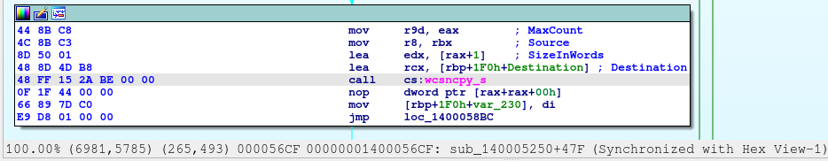

L'instruction `call cs:wcsnpy_s` a pour opcode `48 FF 15 2A BE 00 00`, c'est-à-dire `call qword [rip + 0xbe2a]` :

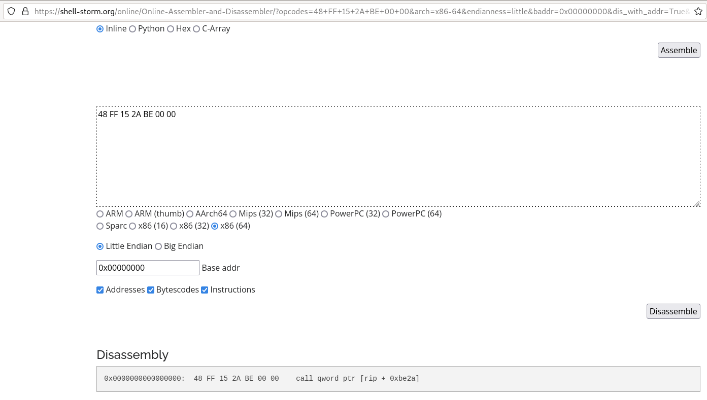

On remarque que si l'on additionne l'adresse de la prochaine instruction à exécuter (`0x56d6`) 

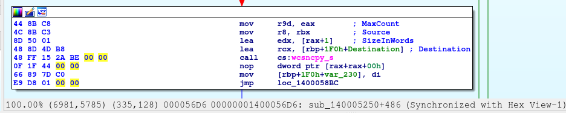

à l'offset contenu dans l'opcode décodé (`0xbe2a`) on trouve `0x11500`, qui est justement la RVA de l'IAT de la dll `msvcrt.dll` :

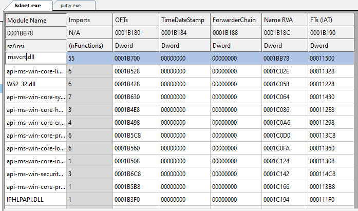

La RVA de l'ILT est par ailleurs `0x1b700`.

On lance `kdnet.exe` dans le débugger d'IDA. L'exécutable `kdnet.exe` est projeté à l'adresse `0x00007FF73A030000` : 

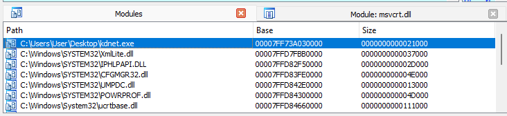

L'ILT est donc à l'adresse `00007FF73A030000 + 0x1b700 = 0x7FF73A04B700`.

À l'adresse `0x7FF73A04B700` on lit `0x01ba80` qui est l'`OrdinalOrHintNameRVA` de la fonction importée.

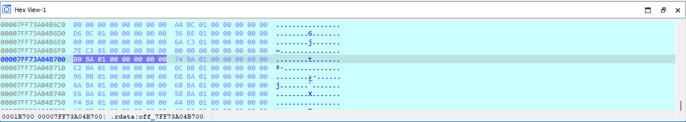

Comme le bit de poids faible est nul, c'est un import par nom, et l'entrée est la RVA du nom de la fonction importée.

La Virtual Address de ce nom est la somme de l'adresse de base du programme `kdnet.exe` et de la Relative Virtual Address, soit 

`0x00007FF73A030000 + 0x01ba80 = 0x7FF73A04BA80`.

À cette adresse on lit la valeur `\x1a\x05wcsnpy_s` : 

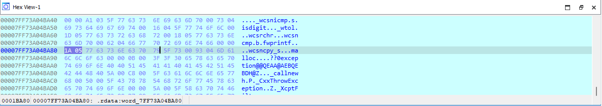

On retrouve bien la valeur `0x51a` pour l'hint de la fonction `wcsnpy_s` :

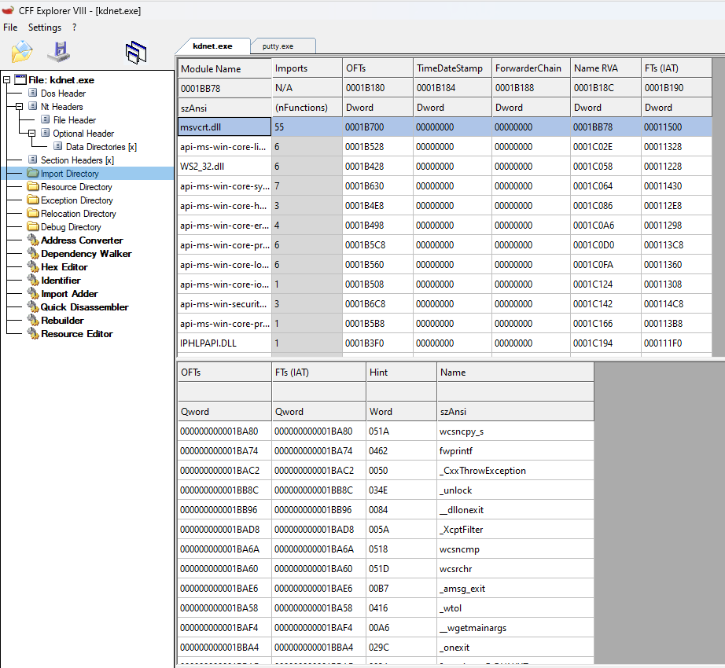

La RVA de l'IAT est `0x11500`, donc à l'exécution sa VA est `0x00007FF73A030000 + 0x11500 = 0x7FF73A041500`.

À cette VA on lit l'`OrdinalOrHintNameRVA` `0x7FFD84E830A0` : 

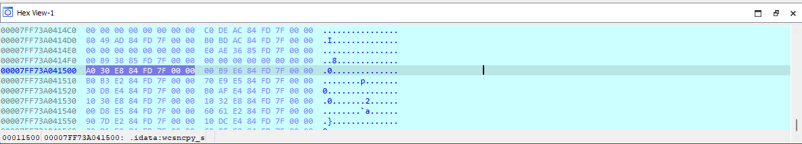

Et cette adresse est justement celle du point d'entrée de `wcsnpy_s` !

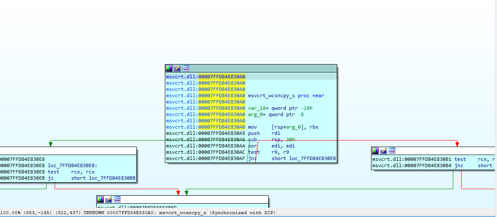

## Récapitulatif de l'heuristique d'import

Pour résoudre les imports, le loader va grosso modo procéder ainsi :

- Il parcourt l'Import Table Directory. Chaque entrée, qui est l'Import Table Entry d'une dll est traitée. La dernière entrée est entièrement constituée d'octets nuls, délimitant la fin de l'Import Table Directory.

- Pour chacune de ces entrées, le loader accède à l'IAT pointée au travers de sa RVA.

- Il parcourt alors toutes les entrées de l'IAT, et là encore s'arrête lorsqu'il trouve une entrée nulle.

- Pour chaque entrée de l'IAT, le loader remplace la valeur de l'entrée par l'adresse de la fonction importée.

- Dans le cas d'un import par ordinal, le loader utilise la valeur de l'ordinal pour déterminer l'adresse de la fonction,

- Dans le cas d'un import par nom, le loader utilise le nom de la fonction pour déterminer l'adresse de la fonction.

# Cas d'une DLL : La Table des exports

Une dll exporte des fonctions.

L'export de fonction repose sur :

- L'Export Directory Table, qui ne possède qu'une seule entrée. Les principales informations de cette table sont :

   - Le nom de la dll (la RVA du nom, plus précisément),

   - Le nombre de fonctions exportées,

   - Le nombre d'entrées dans la Name Pointer Table (et dans l'Ordinal Table),

   - La RVA de l'Ordinal Table,

   - La RVA de l'Export Address Table,

   - La RVA de la Name Pointer Table,
   
- L'Export Address Table, qui contient les adresses du point d'entrée des fonctions exportées,

- La Name Pointer Table, qui contient le nom de chaque fonction exportée,

- L'Ordinal Table, qui contient l'ordinal de chaque fonction exportée.

## Structure de l'Export Directory Table

L'Export Directory Table a cette structure :

```
struct {
    DWORD   ExportFlag;	// réservé, doit valoir 0
    DWORD	TimeDateStamp;	// date à laquelle les données d'export ont été créées
    WORD		MajorVersion;
    WORD		MinorVersion;
    DWORD	DllNameRVA;	// RVA du nom de la dll
    DWORD	OrdinalBase; // Ordinal de départ
    DWORD	AddressTableEntries; // Nombre de fonctions exportées
    DWORD	NumberOfNamePointers; // Nombre de noms/d'ordinaux dans la Name Pointer Table / l'Ordinal Table
    DWORD	ExportAddressTableRVA; // RVA de l'Export Address Table
    DWORD	NamePointerRVA; // RVA de la Name Pointer Table
    DWORD	OrdinalTableRVA; // RVA de l'Ordinal Table
} EXPORT_DIRECTORY_TABLE;
```

## L'Export Address Table

C'est une table contenant `AddressTableEntries` entrées. Chaque entrée est la RVA du point d'entrée d'une des fonctions exportée.

## La Name Pointer Table

C'est une table contenant `NumberOfNamePointers` entrées. Chaque entrée est la RVA du nom d'une fonction exportée.

## L'Ordinal Table

C'est une table contenant `NumberOfNamePointers` entrées. Chaque entrée est le l'ordinal relatif d'une fonction exportée.

Son ordinal est la somme de cet ordinal relatif et de `OrdinalBase`.
